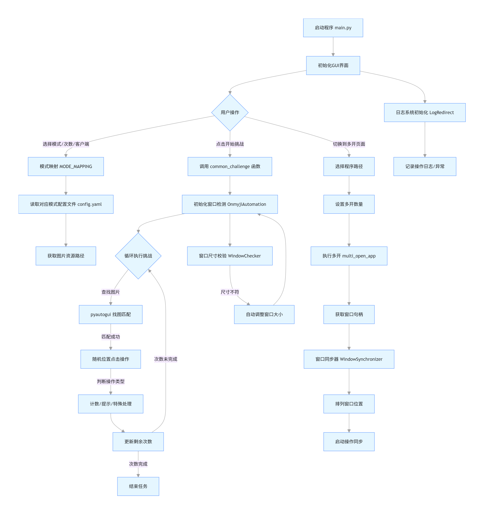

# OnmyojiAuto - 阴阳师自动化工具

  
（可自行替换背景图片：将替换后的png图片图片命名为`background.png`即可覆盖）


## 📌 项目简介
OnmyojiAuto是一款基于Python开发的阴阳师游戏自动化辅助工具，通过计算机视觉技术实现游戏内的图像识别与自动点击，帮助玩家高效完成各类副本任务。工具支持多窗口同步操作，配备直观的GUI界面，降低使用门槛。


## ✨ 功能特性
- **多客户端支持**：兼容阴阳师桌面版与MuMu模拟器
- **丰富副本覆盖**：支持魂土、魂王、业原火、觉醒、爬塔（门票/体力）、灵染试炼、御灵、契灵探查等多种副本
- **便捷操作体验**：图形化界面（GUI）设计，支持模式选择、次数设置等可视化操作
- **多窗口协同**：支持桌面版窗口同步功能，可实现主窗口操作同步至副窗口
- **智能识别机制**：基于图像识别技术自动寻找目标按钮（如"挑战"、"结束"等）并执行点击
- **安全防护设计**：点击位置随机化，降低账号风险


## 🛠️ 安装步骤

### 1. 克隆仓库
```bash
git clone https://github.com/username/onmyoji-automation.git  # 替换为实际GitHub仓库地址
cd onmyoji-automation/Onmyoji
```

### 2. 安装依赖
使用项目提供的依赖清单安装所需库：
```bash
pip install -r requirements.txt
```
依赖说明：`opencv-python`（图像识别）、`PyQt6`（GUI界面）、`pyautogui`（鼠标操作）、`pywin32`（窗口控制）等。

### 3. 环境配置
- 推荐使用**MuMu模拟器**或**阴阳师桌面版**
- 确保程序以**管理员身份**运行
- 运行期间保持模拟器/游戏窗口**可见**（不可最小化）
- 避免在程序运行时手动操作鼠标


## 🚀 使用指南

### 基本操作
1. 启动程序：
   ```bash
   python main.py
   ```
2. 在GUI界面选择客户端类型（阴阳师桌面版/MuMu模拟器）
3. 选择目标副本模式（如"魂土"、"爬塔"等），部分模式需额外选择子模式（如魂土的"队长"或"队员"）
4. 设置挑战次数（1-10000次）
5. 点击"窗口检测"确认游戏窗口识别正常
6. 点击"开始挑战"启动自动化任务，可通过"紧急停止"终止操作


### 多窗口同步
1. 在"多开"标签页选择游戏客户端路径并设置多开数量，点击"执行多开"。多开功能目前有些问题，建议使用第三方工具多开
2. 在窗口列表中选择主窗口和副窗口
3. 点击"开始同步"后，主窗口的鼠标操作将同步至所有副窗口
4. 点击"排列窗口"可自动调整多窗口位置，便于操作


## ⚙️ 配置说明
- **副本配置**：各副本的图像资源路径定义在`source/[副本名称]/config.yaml`中，可根据游戏版本更新替换对应图片（如`jieshu.png`为"结束"按钮图片）
- **主配置**：`config/config.yaml`用于设置界面背景图和图标，可自定义替换
- 图像资源要求：保持与游戏内按钮尺寸比例一致，避免识别失败


## ⚠️ 注意事项
1. 程序运行时会占用鼠标，请勿手动干预操作
2. 确保游戏窗口分辨率稳定，避免窗口缩放导致识别偏移
3. 程序仅支持Windows操作系统
4. 本工具仅用于学习交流，请勿用于商业用途或违反游戏规定的行为


## ❓ 常见问题
- **窗口识别失败**：检查窗口标题是否正确（桌面版为"阴阳师-网易游戏"，模拟器为"MuMu模拟器5"的“MuMu安卓设备”，如果不是这两个客户端，可以自行修改代码中的窗口标题部分文件）
- **图片识别错误**：验证`source`目录下对应副本的图片资源是否匹配当前游戏版本，可重新截图替换并改成对应文件名字
- **多窗口同步失效**：确认主窗口和副窗口均已正确选择，主窗口需一直可见，副窗口可以最小化，但是需同时确保主副窗口大小不变
- **执行挑战无效**：确保程序是以管理员身份运行，确保窗口大小不变且可见

## 📞 联系作者
- 邮箱：n3032747608@163.com
- 项目版本：v1.3.1


  
